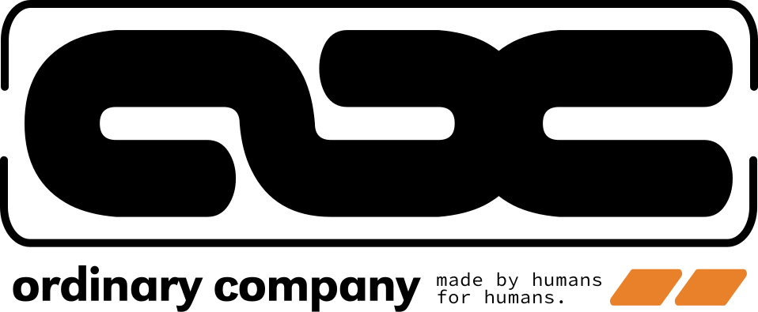

<p align="center">
  
</p>

<p align="center">
  <strong>A creative collective chasing joy, meaning, and connection.</strong>
</p>

<p align="center">
  <a href="https://ordinarycompany.design">
    
  </a>
  
  
  
  
  
</p>

---

## About

This is the source code for the [Ordinary Company Group LLC](https://ordinarycompany.design) website. Ordinary Company is a creative collective of artists, designers, storytellers, musicians, and creatives based in Cincinnati, Ohio.

The site serves as a hub for the company's ventures:

- **[The Lab](https://lab.ordinarycompany.design)** &mdash; Software design & R&D
- **[Guildworks](https://guildworks.itch.io/)** &mdash; TTRPGs, games & animation

## Architecture

```
app/
├── layout.tsx           Root layout (Geist font, global styles)
├── globals.css          Shared styles + 404 page
├── (main)/              Main site route group
│   ├── layout.tsx       Light minimal theme + OG metadata
│   ├── page.tsx         Splash page with venture cards
│   └── not-found.tsx    Themed 404 page
└── lab/                 The Lab subdomain
    ├── layout.tsx       Lab theme (Geist Mono) + OG metadata
    ├── page.tsx         Section orchestrator
    ├── lab.css          Lab-specific styles
    └── components/      HeroSection, ProfileSection, WorkSection, etc.
```

**Subdomain routing:** `proxy.ts` detects the `lab` subdomain and rewrites requests to the `/lab` route, allowing `lab.ordinarycompany.design` to serve the Lab page from the same Next.js app.

## Tech Stack

- **Framework:** Next.js 16 (App Router)
- **Language:** TypeScript 5
- **Styling:** Tailwind CSS 4
- **Animation:** Framer Motion
- **3D:** Three.js (Lab background)
- **Icons:** Lucide React
- **Hosting:** Vercel

## Local Development

```bash
npm install
npm run dev
```

Visit `http://localhost:3000` for the main site.

To test the Lab subdomain locally, visit `http://lab.localhost:3000`.

---

<p align="center">
  <sub>&copy; 2026 Ordinary Company Group LLC. All rights reserved.</sub>
</p>
